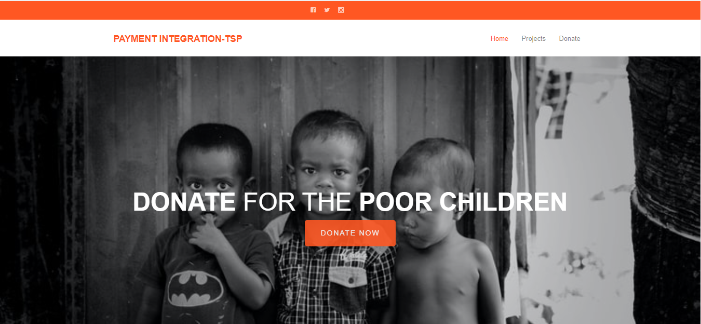
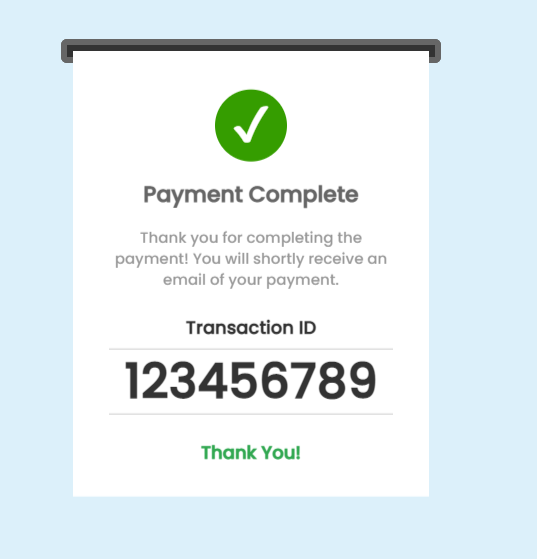

# Payment-Gateway-Integration-The Spark Foundation

## Developer - Ehtesham Ali

## Task
> Payment Gateway Integration - https://confident-poitras-7d2d89.netlify.app/

## Table of contents
* Homepage
* Payment Gateway Interface
* Payment Successful

## About
> Created a simple website where payment gateway is integrated. There is a simple donate button on homepage, on clicking the donate button, the user will land on the payment page where user can select the amount to be paid and the payment type that includes Credit Card, Netbanking, Paypal and Debit Card. On successful payment an invoice will be generated on a new page regarding completion of the payment.

## Screenshots
 

 

## Technologies
* HTML5
* CSS3
* Javascript
* jQuery
* Bootstrap
* Sass

## Status
> Project - Completed
